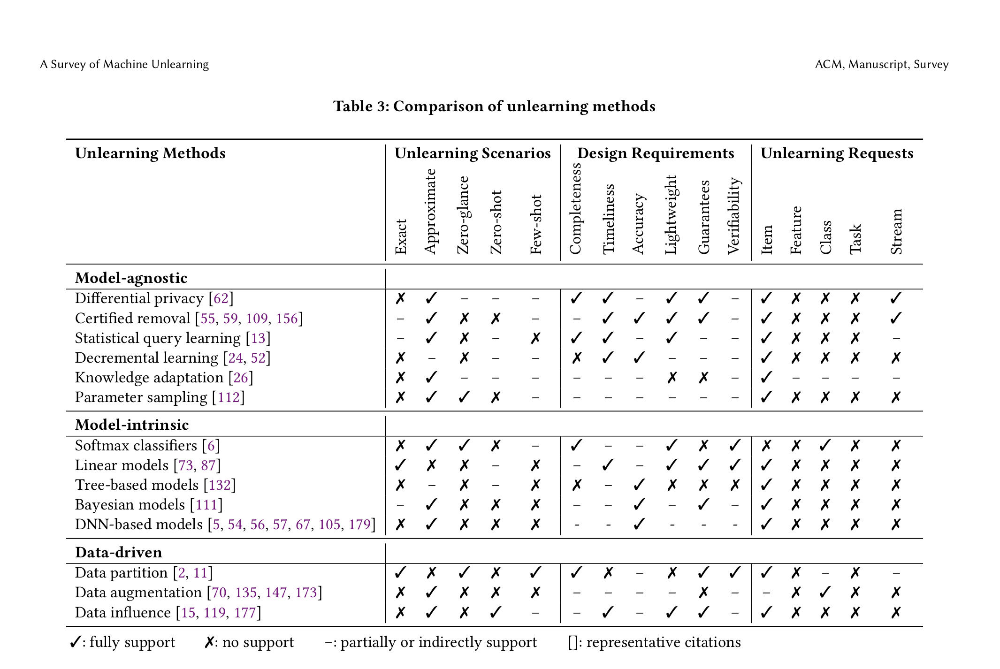

# Notes on Survey Paper

## Note on Nguyen-2022-survey

The main problem addressed in the paper is that simply deleting data from backend databases is insufficient in the AI context because ML models can "remember" old data, making it a privacy risk. The paper discusses how contemporary adversarial attacks on trained ML models can reveal whether specific instances or attributes were part of the training data, further emphasizing the need for a solution.

#### 1.2 Challenges in Machine Unlearning

**Stochasticity of training.** We do not know the impact of each data point seen during training on the machine learning model due to the stochastic nature of the training procedure. Neural networks, for example, are usually trained on random mini-batches containing a certain number of data samples. Further, the order of the training batches is also random. This stochasticity raises difficulties for machine unlearning as the specific data sample to be removed would need to be removed from all batches.

**Incrementality of training.** A model’s training procedure is an incremental process. In other words, the model update on a given data sample will affect the model performance on data samples fed into the model after this data. A model’s performance on this given data sample is also affected by prior data samples. Determining a way to erase the effect of the to-be-removed training sample on further model performance is a challenge for machine unlearning.

**Catastrophic unlearning.** In general, an unlearned model usually performs worse than the model retrained on the remaining data. However, the degradation can be exponential when more data is unlearned. Such sudden degradation is often referred as catastrophic unlearning. Although several studies have explored ways to mitigate catastrophic unlearning by designing special loss functions, how to naturally prevent catastrophic unlearning is still an open question.

#### 2.2 Unlearning Requests

**Item Removal.** Requests to remove certain items/samples from the training data are the most common requests in machine unlearning [11]. The techniques used to unlearn these data are described in detail in Section 5.

#### 2.3 Design Requirements

**Completeness (Consistency).** A good unlearning algorithm should be complete. *That is, the unlearned model and the retrained model should make the same predictions about any possible data sample (whether right or wrong).* One way to measure this consistency is to compute the percentage of the same prediction results on a test data. This requirement can be designed as an optimization objective in an unlearning definition (Section 3.2) by formulating the difference between the output space of the two models. Many works on adversarial attacks can help with this formulation.

**Timeliness.** There needs to be a trade-off between completeness and timeliness.

**Accuracy.** An unlearned model should be able to predict test samples correctly.

**Light-weight.** To prepare for unlearning process, many techniques need to store model checkpoints, historical model updates, training data, and other temporary data. A good unlearning algorithm should be light-weight and scale with big data. Any other computational overhead beside unlearning time and storage cost should be reduced as well.

**Provable guarantees.** With the exception of retraining, any unlearning process might be inherently approximate. It is practical for an unlearning method to provide a provable guarantee on the unlearned model.

**Model-agnostic.** An unlearning process should be generic for different learning algorithms and machine learning models, especially with provable guarantees as well.

**Verifiability.** Beyond unlearning requests, another demand by users is to verify that the unlearned model now protects their privacy. To this end, a good unlearning framework should provide end-users with a verification mechanism. For example, backdoor attacks can be used to verify unlearning by injecting backdoor samples into the training data [142]. If the backdoor can be detected in the original model while not detected in the unlearned model, then verification is considered to be a success. However, such verification might be too intrusive for a trustworthy machine learning system and the verification might still introduce false positive due to the inherent uncertainty in backdoor detection.

### 5. UNLEARNING ALGORITHMS

The specific approaches of machine unlearning can be categorized into **model-agnostic**, **model-intrinsic**, and **data-driven** approaches.

#### 5.1 Model-Agnostic Approaches

**Differential Privacy.** Differential privacy was first proposed to bound a data sample’s influence on a machine learning model. $\epsilon$-differential privacy unlearns a data sample by setting $\epsilon$ = 0, where $\epsilon$ bounds the level of change in any model parameters affected by that data sample. However, Bourtoule et al. notes that the algorithm cannot learn from the training data in such a case.

Gupta et el. [62] proposed a differentially private unlearning mechanism for streaming data removal requests. These requests are adaptive as well, meaning the data to be removed depends on the current unlearned model. The idea, which is based on differential privacy, can be roughly formulated as:
$$
Pr(U (D, s, A(D)) \in T ) ≤  e^{\epsilon} Pr (A(D \backslash s) \in T ) + \beta
$$
for all adaptive removal sequences $s = (z_1, ..., z_k)$. One weakness of this condition is that it only guarantees the upper bound of the unlearning scheme compared to full retraining. However, its strength is that it supports a user’s belief that the system has engaged in full retraining. Finally, an unlearning process is developed by a notion of differentially private publishing functions and a theoretical reduction from adaptive to non-adaptive sequences. Differentially private publishing functions guarantee that the model before and after an unlearning request do not differ too much.

**Certified Removal Mechanisms.** Unlearning algorithms falling into this category are the ones following the original approximate definition of machine unlearning [55, 59]. While Guo et al. focus on theoretical guarantees for linear models and convex losses, Golatkar et al. [55] introduce a computable upper bound for SGD-based learning algorithms, especially deep neural networks. The core idea is based on the notion of perturbation (noise) to mask the small residue incurred by the gradient-based update (e.g., a one-step Newton update [82]). The idea is applicable to other cases,
although no theoretical guarantees are provided [11].

More precisely, certified removal mechanisms mainly accommodate those linear models that minimize a standardized empirical risk, which is the total value of a convex loss function that measures the distance of the actual value from the expected one [100]. However, one has to rely on a customized learning algorithm that optimizes a perturbed version of the regularized empirical risk, where the added noise is drawn from a standard normal distribution. This normalized noise allows conventional convex optimization techniques to solve the learning problem with perturbation. As a result, the unlearning request can be done by computing the model perturbation towards the regularized empirical risk on the remaining data. The final trick is that this perturbation can be approximated by the influence function [82], which is computed by inverting the Hessian on training data and the gradient of the data to be forgotten [100]. However, the error of model parameters in such a computation can be so large that the added noise cannot mask it. Therefore, if the provided theoretical upper bound exceeds a certain threshold, the unlearning algorithm resorts to retraining from scratch [100]. Following this idea, Neel et al. [109] provided further extensions, namely regularized perturbed gradient descent and distributed perturbed gradient descent, to support weak convex losses and provide theoretical guarantees on indistinguishability, accuracy, and unlearning times.

Ullah et al. [156] continued studying machine unlearning in the context of SGD and streaming removal requests. They define the notation of total variation stability for a learning algorithm:

sup
𝐷,𝐷 ′ : |𝐷\𝐷 ′ |+ |𝐷 ′ \𝐷 |
′
Δ(𝐴(𝐷), 𝐴(𝐷 )) ≤ 𝜌
where Δ(.) is the largest possible difference between the two probabilities such that they can assign to the same event, aka total variance distance [158]. This is also a special case of the optimal transportation cost between two probability distributions [86]. In other words, a learning algorithm 𝐴(.) is said to be 𝜌-TV-stable if given any two training datasets 𝐷 and 𝐷 ′ , as long as they have 1 common data item, the cost of transporting from the model distribution 𝐴(𝐷) to 𝐴(𝐷 ′ ) is bounded by 𝜌. For any 1/𝑛 ≤ 𝜌 < ∞, Ullah et al. [156] proved that there exists an unlearning process that satisfies exact unlearning at any time in the streaming removal request while the model accuracy and the unlearning time are bounded
w.r.t. $Q$.